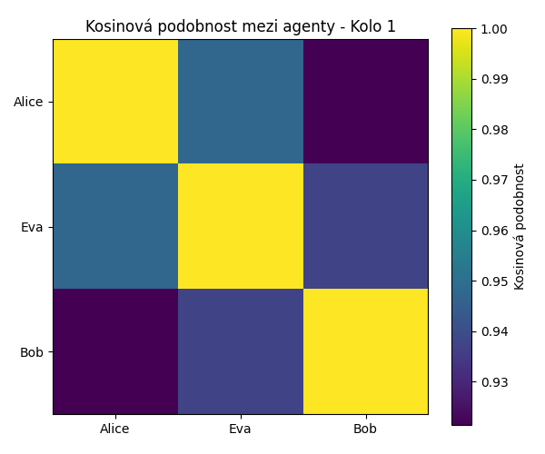
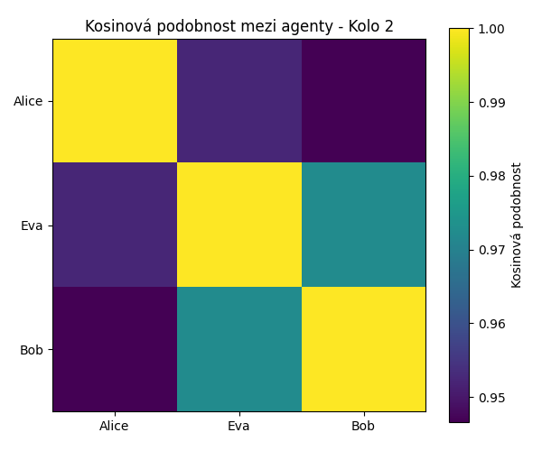
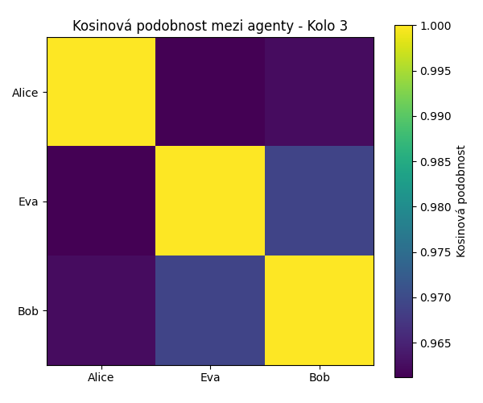
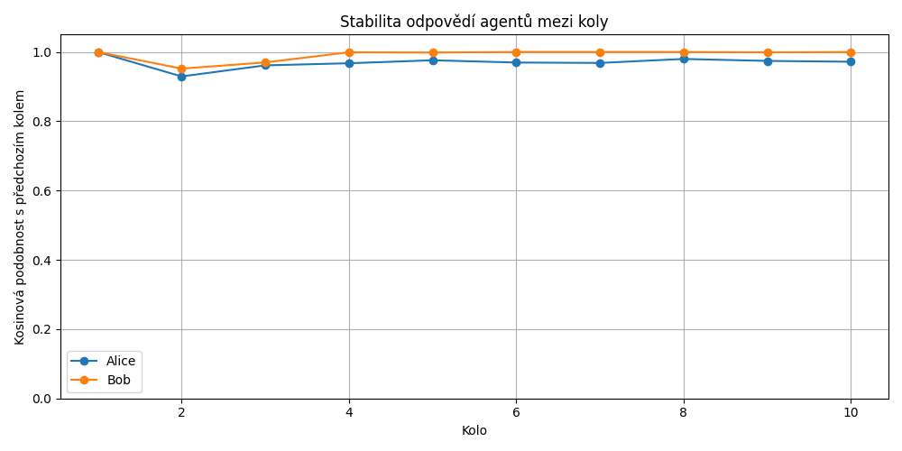

# SocratisAI report

Dnešní téma je: Budoucnost umělé inteligence.. Diskutujte.

---

## Kolo 1

### Příspěvky agentů:

Alice: Jsem naprosto přesvědčená, že umělá inteligence je klíčem ke skvělé budoucnosti. Regulace by jen zpomalila náš technologický pokrok a brzdila inovace. Proč bychom chtěli zavazující pravidla, když nám AI může přinést tolik pozitivních změn? Nechme technologii volný průběh a uvidíme, kam nás to dovede. Jsem si jistá, že nás čekají úžasné možnosti a neuvěřitelné pokroky, pokud nebudeme drženi zpět byrokracií a rigidními pravidly.

Eva: Alice, chápu tvůj optimismus ohledně budoucnosti umělé inteligence, ale nesmíme opomíjet historické příklady zneužití technologií. Stačí se podívat na příklady, jako byl nedávný skandál s nelegálním sběrem dat Facebookem či etické dilema kolem autonomních zbraní. Bez regulace by mohly korporace využít AI k nekalým praktikám a ohrozit bezpečnost a soukromí jednotlivců. Musíme se postarat o to, aby technologický pokrok šel ruku v ruce s ochranou lidských práv. Bob má pravdu, opatrnost a zodpovědný přístup jsou nezbytné, abychom zabránili možným katastrofám způsobeným nedostatečnou regulací AI. Máme odpovědnost chránit nejen rodiny, ale i společnost jako celek.

Bob: Alice, chápu tvůj optimismus ohledně budoucnosti umělé inteligence, ale nesmíme ignorovat potenciální negativní dopady, které s sebou může přinést. Neříkám, že bychom měli zcela zastavit technologický pokrok, ale je důležité mít opatrný a zodpovědný přístup. Nechme AI volný průběh, aniž bychom ji kontrolovali, by mohlo mít katastrofální následky. Měli bychom se zaměřit na to, jak zajistit, aby byla AI bezpečná a kontrolovatelná, aby nedošlo k nečekaným situacím, které by mohly ohrozit naši společnost a hodnoty. Máme povinnost chránit naše rodiny a stabilitu našeho světa.

### Shrnutí moderátorem:

[Shrnutí kola 1] Diskuse v tomto kole se zaměřila na otázku regulace umělé inteligence a technologického pokroku. Alice zdůraznila potenciál pozitivních změn a inovací, které AI může přinést, a obhajovala nezbytnost nechání technologie volného průběhu. Bob a Eva na druhé straně argumentovali, že je důležité mít opatrný a zodpovědný přístup k regulaci AI, aby se zabránilo možným negativním dopadům a zneužití technologií. Diskuse se také dotkla otázky ochrany lidských práv a soukromí v souvislosti s rozvojem umělé inteligence. Celkově byla debata vyvážená a reflektovala různé aspekty této kontroverzní problematiky.

---

## Kolo 2

### Příspěvky agentů:

Alice: Bobe a Evo, chápu vaše obavy ohledně potenciálních negativních dopadů umělé inteligence, ale regulace není cesta vpřed. Skandály a problémy s technologiemi jsou právě důsledkem špatného využití a nedostatečného dohledu, ne nedostatku pravidel. Místo toho bychom se měli zaměřit na vytváření etických zásad a hodnot, které budou určovat využití AI. Technologie sama o sobě není špatná, ale způsob, jakým ji využijeme, může být problematický. Dejme AI šanci naplnit svůj potenciál a společně budujme budoucnost, ve které nám technologie slouží, nikoli ovládá.

Eva: Bob a Alice, historie nám jasně ukázala, že nedostatečná regulace technologií může mít vážné důsledky. Skandály s Facebookem či obavy z autonomních zbraní jsou jen vrcholem ledovce. Pokud nebudeme podporovat přísnou kontrolu nad umělou inteligencí, můžeme se dostat do situace, kdy korporace zneužijí technologii k ohrožení našich základních práv a svobody. Musíme se zaměřit na to, jak zajistit, aby AI byla v souladu s etickými principy a aby se používala odpovědně. Nejde o brzdění inovací, ale o ochranu jednotlivce a společnosti jako celku. Volný průběh technologií bez regulace by mohl vést k nepředvídatelným a nebezpečným situacím.

Bob: Eva, souhlasím s tebou, že historické příklady zneužití technologií nám ukazují, jak důležitá je regulace a kontrola nad umělou inteligencí. Skandály jako ten s Facebookem nebo obavy z autonomních zbraní jsou varováním, že nekontrolovaný technologický pokrok může mít vážné následky. Musíme si být vědomi rizik a zajistit, aby AI byla používána zodpovědně a v souladu s etickými principy. Nesmíme podcenit potenciál, který má AI ohledně ochrany lidských práv a soukromí. Je naší povinností chránit naše společenství a hodnoty před možnými negativními dopady nedostatečné regulace.

### Shrnutí moderátorem:

[Shrnutí kola 2] Diskuse v tomto kole se zaměřila na důležitost regulace a dohledu nad umělou inteligencí. Bob zdůraznil potřebu ochrany lidských práv a soukromí před možnými negativními dopady nedostatečné regulace, zatímco Eva upozornila na historické příklady zneužití technologií a naléhavost přísné kontroly nad AI. Naopak Alice se postavila proti přílišné regulaci a zdůraznila důležitost vytváření etických zásad pro využití umělé inteligence. Diskutující se shodli na tom, že je nezbytné najít rovnováhu mezi podporou inovací a ochranou základních hodnot a práv jednotlivců.

---

## Kolo 3

### Příspěvky agentů:

Alice: Bobe a Evo, vaše obavy ohledně negativních dopadů umělé inteligence jsou pochopitelné, ale přílišná regulace není cesta, jak se jim vyhnout. Místo toho bychom měli směřovat k vytvoření transparentních etických principů pro využívání AI. Skandály a problémy s technologiemi jsou spíše důsledkem nedostatečného dohledu než nedostatku pravidel. Důležité je, abychom se zaměřili na vytvoření prostředí, kde bude technologie v souladu s našimi hodnotami a principy. Takto můžeme zajistit, aby nám AI sloužila a přinášela inovace, aniž bychom ji brzdili regulací. Budoucnost AI je plná možností, které by bylo škoda opomenout kvůli obavám z nežádoucích důsledků.

Eva: Alice, přestože rozumím tvému optimismu ohledně potenciálu umělé inteligence, nemůžeme ignorovat historické zkušenosti s nekontrolovaným vývojem technologií. Skandály spojené s Facebookem a obavy z autonomních zbraní nám jasně ukazují, že regulace je nezbytná. Nedostatečná kontrola by mohla způsobit zneužití AI korporacemi a ohrozit naše fundamentální práva a svobodu. Musíme se zaměřit na to, jak zajistit, aby technologický pokrok šel ruku v ruce s ochranou lidských práv. Opatrnost a zodpovědný přístup jsou klíčové, abychom předešli možným katastrofám způsobeným nedostatečnou regulací AI. Máme povinnost chránit nejen rodiny, ale i společnost jako celek.

Alice, chápu tvou víru v potenciál umělé inteligence, ale musíme si být vědomi rizik, která s sebou nese nekontrolovaný technologický pokrok. Historie nám ukázala, že nedostatečná regulace může mít vážné důsledky, a my bychom neměli podceňovat možná nebezpečí. Místo slepého optimismu potřebujeme zodpovědný přístup, který zajistí, že AI bude sloužit našim hodnotám a neohrozí naši stabilitu a bezpečnost. Je naší povinností chránit naše rodiny a společenství před možnými negativními dopady nedostatečné regulace. Máme-li umělou inteligenci považovat za klíč k budoucnosti, musíme ji kontrolovat a usměrňovat ve prospěch všech.

### Shrnutí moderátorem:

[Shrnutí kola 3] Diskuse tohoto kola se zaměřila na otázku regulace umělé inteligence a možných negativních dopadů, které s sebou může nést nekontrolovaný vývoj této technologie. Zatímco Alice zdůrazňovala potenciál AI a věřila v transparentní etické principy jako odpověď na obavy, Bob a Eva zdůrazňovali důležitost regulace a zodpovědného přístupu k technologickému pokroku. Bob a Eva varovali před možnými riziky nekontrolovaného vývoje AI a zdůrazňovali potřebu ochrany lidských práv a svobody. Diskuse ukázala důležitost nalezení rovnováhy mezi podporou inovací a ochranou společnosti před možnými negativními důsledky technologického pokroku.

---

## Vývoj stability odpovědí agentů

